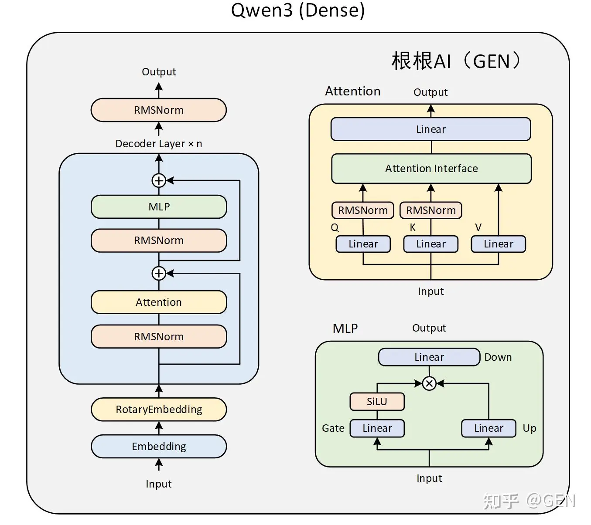
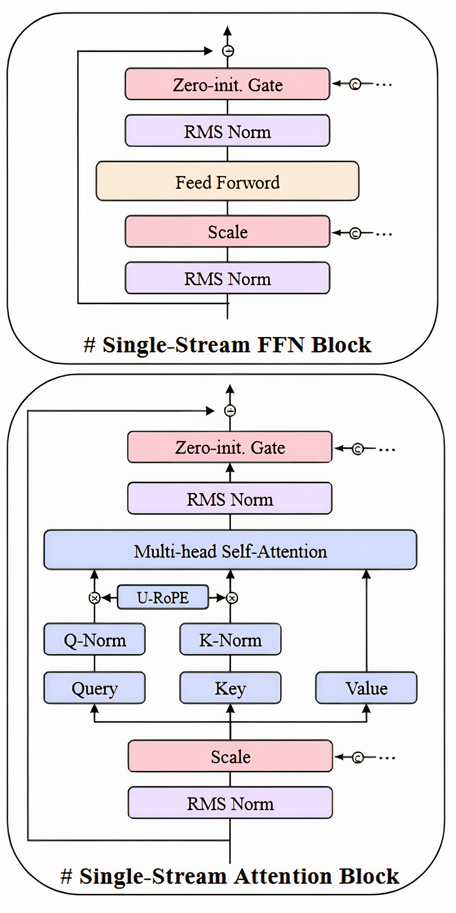
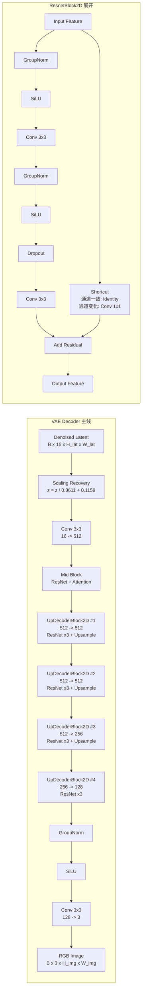

# Z-Image 架构说明

---

## 1. 系统定位

Z-Image 是阿里通义开源的文生图(**Text-to-Image**) 基础模型，参数量约 **6B** ，核心生成骨干为 **S3-DiT**（Scalable Single-Stream Diffusion Transformer）, 它不是 FLUX/Qwen-Image 那类显式双流结构，而是把不同模态 token 早融合到同一条序列里，让每一层 self-attention 都能做跨模态交互。

同赛道常见方案（Qwen-Image、FLUX、Hunyuan-Image 等）参数量多在 20B–80B。Z-Image 的设计目标是：在较小参数量下，通过架构与训练流程优化，达到可接受的生成质量与推理成本。

公开变体：

| 变体 | 用途 | 推理特点 |
|------|------|----------|
| Z-Image | 标准文生图 | 多步 Flow Matching 去噪 |
| Z-Image-Turbo | 加速文生图 | 蒸馏后约 **8 NFE**（Number of Function Evaluations），通常 `guidance_scale=0` |
| Z-Image-Edit | 指令编辑 | 在 omni 架构上扩展，支持 reference image + 编辑指令 |

---

## 2. 整体组成

Z-Image 推理系统由三个独立权重模块串联：

```text
┌─────────────┐     ┌──────────────────────┐     ┌─────────────┐
│ Text Encoder│     │ S3-DiT (Transformer) │     │  VAE Decoder│
│  Qwen3-4B   │────►│  去噪 / 预测 velocity │────►│  Flux VAE   │
└─────────────┘     └──────────────────────┘     └─────────────┘
       ▲                       ▲
   Prompt 文本            噪声 Latent + Timestep
```

| 模块 | 角色 | 输入 | 输出 |
|------|------|------|------|
| **Text Encoder** | 将自然语言 prompt 编码为数值条件向量 | token 序列 | caption 特征矩阵（hidden states） |
| **S3-DiT** | 在 latent 空间迭代去噪 | 噪声 latent、timestep、caption 特征 | 每步对 latent 的修正量 |
| **VAE Decoder** | 将 latent 解码为像素图像 | 去噪完成的 latent | RGB 图像 |

> 三者 checkpoint 分开存放，推理时可分阶段加载.

---

## 3. Text Encoder（文本编码器）

Text Encoder 的作用是把自然语言 prompt 转成一组条件 token。Z-Image 使用 **Qwen3-4B** 作为 Text Encoder，利用它的中英文理解能力和指令理解能力。

Text Encoder 输出 caption 特征，供后面的 S3-DiT 使用。

- 输入是用户 prompt。推理时 prompt 会先被格式化成对话模板，再进入 Qwen3-4B。
- 输出是每个文本 token 对应的 hidden state。Z-Image 不使用语言模型最后的词表 logits，也不让 Qwen 自回归生成文本。它取中间层 hidden states 作为图像生成条件。

这些 caption features 进入 S3-DiT 前，会先被投影到 S3-DiT 的 hidden dimension。公开实现中 caption feature dimension 是 2560，S3-DiT hidden dimension 是 3840。

```text
Prompt
  → Tokenizer / Chat Template
  → Qwen3-4B Text Encoder
  → caption features
```



上图可以作为 Z-Image Text Encoder 的结构参考。Prompt token 先经过 embedding 和 RotaryEmbedding（旋转位置编码），再进入多层 decoder layer。每层包含 self-attention 和 MLP，并使用 RMSNorm、残差连接和 gated MLP。Z-Image 使用这一路前向计算得到文本 token 的 hidden states。

这里的 Text Encoder 只做编码。它不使用图中最上方的语言模型输出去预测下一个 token，也不在推理时生成一段新文本。Z-Image 取 Qwen3-4B 的 hidden states 作为 caption features，再交给 S3-DiT。

**外置 Text Encoder**

文生图模型需要理解长 prompt、物体关系、风格描述、文字渲染要求和中英文混合指令。把这部分交给一个成熟的 Large Language Model（大语言模型）可以减少 DiT 主干承担的语言理解压力。

这种设计和 Stable Diffusion / FLUX / Qwen-Image 类似：文本理解模块和图像生成模块分开。区别在于 Z-Image 选择 Qwen3-4B 作为轻量但能力较强的文本编码器，并通过 Prompt Enhancer（提示词增强器）补足复杂世界知识和推理型 prompt 的理解。

---

## 4. S3-DiT（Scalable Single-Stream Diffusion Transformer）

S3-DiT 是 Z-Image 的生成主干。它在 latent 空间工作，每一步接收 noisy latent、timestep 和 caption features，输出对 latent 的预测修正量。

Z-Image 的主要架构特点集中在 S3-DiT：单流融合、多模态 token 统一建模、30 层 Transformer backbone，以及面向稳定训练的归一化和条件注入设计。

### 4.1 Single-Stream 的含义

Single-Stream（单流）指文本 token、图像 latent token，以及编辑场景中的参考图像 token，会被拼接成一条统一序列，然后进入同一组 Transformer layers。

```text
caption tokens ─┐
image tokens   ├─ concat → unified tokens → Transformer layers
semantic tokens┘
```

> 这里没有长期独立的 text stream 和 image stream。所有 token 在同一个 self-attention 中交互。

这和一些 **Dual-Stream（双流）** 架构不同。双流架构通常把文本 token 和图像 token 放在两条分支里分别处理：文本分支保留文本表示，图像分支保留图像表示；两条分支之间再通过 **Cross-Attention（交叉注意力）** 交换信息。这里的 Cross-Attention 指的是：图像 token 用自己的 Query 去读取文本 token 的 Key/Value，或反过来读取另一模态的信息。

Z-Image 采用 **Single-Stream（单流）** 结构。它先把 caption tokens 和 image tokens 投影到同一 hidden 维度，再在序列维拼接成一条 unified sequence，后续 30 层主链都在这条混合序列上做 Self-Attention。这样文本和图像从进入 backbone 开始就在同一套参数里交互。这个设计减少了长期维护两套分支的成本，也提高了跨模态参数复用率。

### 4.2 Backbone：30 层单流 Transformer

经过模态处理后，所有 token 被拼接成 unified sequence，进入 30 层 single-stream Transformer backbone。



上图展示的是 single-stream backbone 中一个 Transformer block 的两部分。下半部分是 Single-Stream Attention Block，上半部分是 Single-Stream FFN Block。Z-Image 的 30 层主干可以理解为重复执行这类 block。

Attention 负责 token 之间的信息交换。因为文本 token 和图像 token 已在同一序列中，self-attention 可以直接建模“某个文本描述”和“某个图像区域 token”之间的关系。

**Timestep 条件注入**

Diffusion / Flow Matching 模型每一步的噪声强度不同，所以 S3-DiT 必须知道当前 timestep。

Z-Image 使用 timestep embedding 生成条件向量，并把条件注入到 Attention 和 FFN 子块中。注入方式是生成 scale 和 gate：

- scale 调制归一化后的输入。
- gate 控制子块输出写回 residual 的强度。

**3D Unified RoPE**

Z-Image 使用 **3D Unified RoPE**（统一三维旋转位置编码）给 unified sequence 提供位置信息。

文本、图像、编辑图像等 token 都映射到统一的 (t,h,w) 坐标体系里，让 single-stream self-attention 在同一序列中同时理解文本顺序、图像空间位置和多图关系

---

## 5. VAE Decoder（变分自编码器解码器）

VAE Decoder 负责把 S3-DiT 生成完成的 latent 还原成 RGB 图像。Z-Image 使用的是 **Flux VAE**。

```text
denoised latent [B,16,H,W]
  → latents / scaling_factor + shift_factor
  → Flux VAE Decoder
    → Conv: 16 → 512
    → Mid ResNet + Attention
    → 4 个 UpDecoderBlock2D（逐级上采样）
    → GroupNorm + SiLU + Conv
  → RGB image [B,3,H_img,W_img]
```




**VAE 在推理中的角色**

- 文生图推理时，VAE Encoder 通常不参与。流程从随机 latent 噪声开始，经过 S3-DiT 多步去噪，最后由 VAE Decoder 解码。
- 图生图和编辑场景会使用 VAE Encoder，把输入图像或参考图像编码成 latent 条件。普通 text-to-image 场景只需要 Decoder。

---

## 6. Z-Image 的整体特点

Z-Image 的架构可以概括为：

- Qwen3-4B 负责文本理解。
- S3-DiT 负责 latent 空间中的跨模态融合和去噪。
- Flux VAE 负责 latent 到图像的解码。
- Single-stream backbone 让 text / image token 在每层直接交互。

这个设计和同类 latent diffusion / diffusion transformer 模型共享基本范式，但在参数效率和单流融合上更激进。它的目标是在较小参数量下保留足够的 prompt understanding、图像质量和推理速度。
